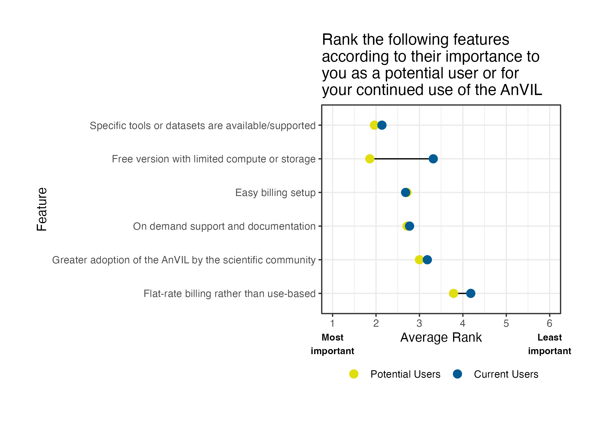

# Analysis of the State of the AnVIL 2024 Poll
Analysis of the State of the AnVIL 2024 Poll

## Demographics

### Institutional affiliation

### Highest Degree attained

### Genomics and Clinical Research Experience

## Insights

### Feature importance for current vs potential users

