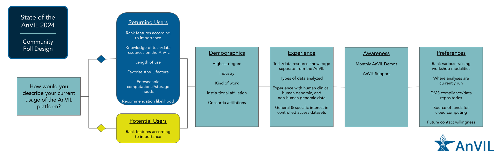

```{r, message = FALSE, echo = FALSE,results='hide', warning=FALSE}
library(here)
library(patchwork)
library(ggpubr)
library(tibble)
library(ggtext)

# Inherit plots
knitr::knit_child(here("anvilPoll2024MainAnalysis.Rmd"))
```

## Figure 1: Flowchart



## Figure 2: Type of User Identification and Background

```{r, fig.width = 10, fig.height = 14}

(typeOfUserPlot + xlim(c(0,45)) + ggtitle(""))  /
  (degreePlot + xlim(c(0,45)) + ggtitle("")) /
  (instTypePlot + xlim(c(0,45)) + ggtitle("")) +
  plot_layout(guides = 'collect',
              axis_title="collect") +
  plot_annotation(title = "Type of user identification and background",
                  caption = 'A: The AnVIL Community poll asked all respondents "How would you describe your current usage of the AnVIL platform?" Respondents were identified as returning or potential AnVIL users based on their responses. Of the 50 responses, 22 are returning users and 28 are potential users. The majority of returning users belong to the group who use the AnVIL for ongoing projects while the majority of potential users are evenly split between those who have never used the AnVIL (but have heard of it) and those who have used the AnVIL previously, but don’t currently. B: The AnVIL Community poll asked "What is the highest degree you have attained?" Most of the respondents have a PhD or are currently working on a PhD, though a range of career stages are represented. C: The AnVIL Community Poll asked all respondents "What institution are you affiliated with?" Most of the individuals using the AnVIL report being affiliated with a research intensive institution.',
                  tag_levels = 'A',
                  theme = theme(plot.title = element_text(size = 16),
                                plot.caption.position = "plot",
                                plot.caption = ggtext::element_textbox_simple(hjust = 0),
                                plot.tag = element_text(face = "bold")))

ggsave(here("plots/user_identification_panels.png"), width=10, height=14, units = "in")
```

## Figure 3: User research experience  

```{r, fig.width=7, fig.height = 9}
genomicsExpPlot_replot /
  vennExperience + 
  plot_annotation(title = "User research experience",
                  caption = 'A: The AnVIL Community Poll asked respondents "How much experience do you have analyzing the following data categories?" 21 respondents report that they are extremely experienced in analyzing human genomic data, while only 6 respondents report that they are not at all experienced in analyzing human genomic data. However, for human clinical data and non-human genomic data, more respondents report being not at all experienced in analyzing those data than report being extremely experienced. B: Venn diagram showing the overlap for respondents who reported being moderately or extremely experienced for these various research categories (n = 37). 32% reported moderate or extreme experience for all 3 research categories; the next highest percentage (27%) reported moderate or extreme experience for human genomic data only with no overlap with other research categories.', 
                  tag_levels = 'A', theme = theme(plot.title = element_text(size = 16),
                                plot.caption.position = "plot",
                                plot.caption = ggtext::element_textbox_simple(hjust = 0),
                                plot.tag = element_text(face = "bold"))) +
  plot_layout(widths = c(7), heights = c(5, 4))

ggsave(here("plots/user_research_experience_panels.png"), width=7, height=9, units = "in")

```

## Figure 4: User Preferences

```{r, fig.width = 8, fig.height = 10}
(gdumbbell + ggtitle("")) /
  plot_spacer() /
  (tdumbbell + ggtitle("")) +
  plot_annotation(title = "User preferences",
                  caption = 'A: The AnVIL Community poll asked all users to "Rank the following features according to their importance to you as a potential user or for your continued use of the AnVIL." Responses were averaged within potential and returning user cohorts to find an average rank. All respondents rate having specific tools or datasets supported/available as an important feature for using AnVIL. Compared to returning users, potential users rate having a free-version with limited compute or storage as the most important feature for their potential use of the AnVIL. B: The AnVIL Community poll asked all respondents "Rank how/where you would prefer to attend AnVIL training workshops." Responses were averaged within potential and returning user cohorts to find an average rank. Both returning and potential users vastly prefer virtual training workshops over other modalities.',
                  tag_levels = "A",
                  theme = theme(plot.title = element_text(size = 16),
                                plot.caption.position = "plot",
                                plot.caption = ggtext::element_textbox_simple(hjust = 0),
                                plot.tag = element_text(face = "bold"))) +
  plot_layout(guides = "collect",
              axis_title = "collect",
              widths = c(8), heights = c(5, 0.25, 3)) & theme(legend.position = 'bottom')

ggsave(here("plots/user_preferences_panels.png"), width=8, height=10, units="in")
```

## Figure 5: User Technological Comfort

```{r, fig.width = 8, fig.height = 11}
(PlotToolKnowledge_avg_score + ggtitle("") + ylab("")) /
  (whereRunPlot + ggtitle("") + ylab("")) + 
  plot_annotation(title = "User technological comfort",
                  caption = 'A: The AnVIL Community poll asked respondents "How would you rate your knowledge of or comfort with these technologies or data features?" Respondents identified as potential users were not asked about technologies or data features on the AnVIL. All respondents were asked about technologies separate from the AnVIL. Comfort scores for each technology or data feature were averaged within user cohorts to find an average knowledge or comfort score. Except for Galaxy, potential users tend to report lower comfort levels for the various tools and technologies when compared to returning users. Overall, there is less comfort with containers or workflows than using various programming languages and integrated development environments (IDEs). B: The AnVIL Community Poll asked all respondents "Where do you currently run analyses?" Respondents could select multiple choices. Institutional HPC and locally run (personal computers) are the most common responses. Google Cloud Platform (GCP) is reported as used more than other cloud providers within this sample. We also see that potential users report using Galaxy (a free option) more than returning users do.',
                  tag_levels = "A",
                  theme = theme(plot.title = element_text(size = 16),
                                plot.caption.position = "plot",
                                plot.caption = ggtext::element_textbox_simple(hjust = 0),
                                plot.tag = element_text(face = "bold")))

ggsave(here("plots/user_tech_comfort_panels.png"), width=8, height=10, units="in")
```

## Figure 6: Support Awareness

```{r, fig.width = 10, fig.height = 8}
((demoPlotRaw + ggtitle("") + xlab("")) + (demoPlot + ggtitle("") + ylab("") + xlab(""))) /
  ((forumPlotRaw + ggtitle("")) + (forumPlot + ggtitle("") + ylab(""))) +
  plot_annotation(title = "User awareness and utilization of AnVIL support",
                  caption = 'A & B: The AnVIL Community poll asked all respondents "Have you attended a monthly AnVIL Demo?" A: Raw responses are shown and we observe that most respondents have not attended an AnVIL Demo. B: To investigate whether the lack of attendance is an awareness issue, all responses except "No, did not know of" are aggregated. We see that the majority of respondents are aware of AnVIL Demos. These responses are just distributed among different ways of utilizing the demos. Further, there is awareness among both returning and potential AnVIL users. C & D: The AnVIL Community Poll asked all respondents "Have you ever read or posted in our AnVIL Support Forum?" C: Raw responses are shown (users could select more than one). Most respondents have not used the AnVIL support forum, but utilization in some form is reported by about 20% of respondents; reading through others’ posts is the most common way of utilizing the support forum within this sample. D: Each set of user responses are recoded and aggregated to examine whether users are or are not aware of the AnVIL Support Forum. We observe that there is awareness of the support forum across potential and returning users.',
                  tag_levels = "A",
                  theme = theme(plot.title = element_text(size = 16),
                                plot.caption.position = "plot",
                                plot.caption = ggtext::element_textbox_simple(hjust = 0),
                                plot.tag = element_text(face = "bold"))) +
  plot_layout(guides = "collect") & theme(legend.position = "bottom")

ggsave(here("plots/awareness_panels.png"), width=10, height=8, units="in")
```

## Figure 7: Personas

```{r, fig.wdith = 8, fig.height = 8}
load(here("data/persona_classifications.rdata"))

kowpersona <- full_join(
  rbind(
     clinician_persona,
     analyst_persona,
     educator_persona,
     pi_persona,
     admin_persona,
     no_persona
  ) %>% 
    ungroup() %>% 
    select(persona, Timestamp) %>%
    mutate(Timestamp = factor(Timestamp),
           persona = na_if(persona, "None Assigned")),
  dfForPlotKOW, by = "Timestamp")

p1 <- ggplot(kowpersona,
       aes(x = Timestamp,
           y = factor(KindOfWork, levels = factorLevel),
           fill = KindOfWork
           )) +
  geom_tile() +
  theme_bw() +
  theme(axis.text.x=element_blank(),
        axis.ticks.x=element_blank(),
        legend.position = "None",
        text = element_text(size=12))+
  ylab("") +
  xlab("") +
  facet_wrap(~UserType, scales = "free_x")

p2 <-ggplot(kowpersona,
       aes(x = Timestamp,
           y = -1,
           fill = persona)) +
  geom_col(width = 1) +
  theme_bw() +
  theme(axis.text.x = element_blank(),
        axis.ticks.x=element_blank(),
        axis.text.y = element_blank(),
        axis.ticks.y=element_blank(), 
        strip.text = element_blank(),
        legend.position = "bottom") +
  ylab("") +
  xlab("Respondent") +
  facet_wrap(~UserType,scales = "free_x") +
  ylim(c(0,-1)) +
  scale_fill_grey(start = 0.8, end = 0, na.value = "white")

p3 <- kowpersona %>% 
  select(persona, Timestamp) %>%
  distinct() %>%
  ggplot(aes(x = factor(1), 
           fill=persona)) +
  geom_bar(stat="count", width=1) +
  coord_polar("y", start=0) +
  scale_fill_grey(start = 0.8, end = 0, na.value = "white") +
  theme_void() +
  geom_text(stat='count',
            aes(label = after_stat(..count..)),
            position = position_stack(vjust = 0.5)) +
  theme(legend.position = "none")

p1 / p2 / p3 +
  plot_layout(widths = c(8), heights = c(4, 0.25, 3.5)) +
  plot_annotation(title = "User personas",
                  caption = 'The AnVIL Community Poll asked all respondents "What kind of work do you do?" Possible selections (computational work, computational education, project management, etc.) are shown on the y-axis and cells are colored for each choice a respondent (x-axis) selected. Based on selections, respondents were clustered into Admin, Analyst, Clinician, Educator, PI, and not assigned (NA) personas. These assignments are shown in grayscale along the x-axis with a corresponding pie chart showing the relative abundance of these assignments. Two potential users were assigned "Clinician" personas and four were assigned "Educator" personas, compared to zero and one respectively for returning users. The other personas show similar abundances between potential and returning users.',
                  theme = theme(plot.title = element_text(size = 16),
                                plot.caption.position = "plot",
                                plot.caption = ggtext::element_textbox_simple(hjust = 0)))
  
ggsave(here("plots/personas_panels.png"), width=8, height=8, units="in")
```
