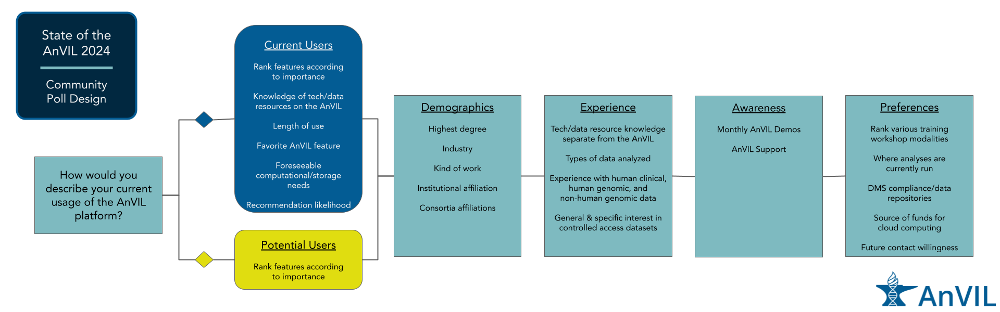

<br>

### **Results Summary**

- [*Identify User Type*](https://hutchdatascience.org/AnVIL_Poll_2024/IdentifyTypeOfUsers.html)
  -  The majority of current users leverage AnVIL for ongoing projects. Potential users were evenly split between never having used the AnVIL (but have heard of it) and having used AnVIL at some point previously.
- [*Demographics*](https://hutchdatascience.org/AnVIL_Poll_2024/Demographics.html)
  - Most of the respondents have a PhD or are currently working on a PhD.
  - Many respondents do computational work.
  - Almost all respondents are affiliated with a research intensive institution.
  - PRIMED, GREGoR, and eMERGE were the most popular consortia affiliations. CCDG and GTEx are also represented.
- [*Experience*](https://hutchdatascience.org/AnVIL_Poll_2024/Experience.html)
  - Overall, respondents report less comfort with containers or workflows than various programming languages and their IDEs.
  - Many respondents report being extremely experienced with human genomic data. Far fewer respondents report being extremely experienced with human clinical or non-human genomic data.
  - Of the survey provided choices, respondents reported accessing or having interest in accessing All of Us, UK Biobank, and GTEx the most over other controlled access datasets.
- [*Awareness*](https://hutchdatascience.org/AnVIL_Poll_2024/Awareness.html)
  - Most respondents are aware of AnVIL Demos, even if they haven't attended one.
  - Most respondents are aware of the AnVIL Support Forum, even if they haven't used it.
- [*Preferences*](https://hutchdatascience.org/AnVIL_Poll_2024/Preferences.html)
  - All respondents rank having specific tools or datasets supported/available as a very important feature for using the AnVIL (and this feature is ranked the highest by *current users*); *Potential users* rate having a free version with limited compute or storage as the most important feature for their potential use of the AnVIL.
  - All respondents prefer virtual training workshops over other training modalities
- [*Current Users*](https://hutchdatascience.org/AnVIL_Poll_2024/CurrentUserQs.html)
  - *For current users*, the most common computational need was needing large amounts of storage.
  - Many users reported they were "extremely likely" to recommend AnVIL, but we'd like to follow up with users who chose differently.

Click on each tab to learn more.

<br>

### **Design**

This user poll was conducted in Spring 2024, with the poll open for responses from February 15th to March 25th. 52 total responses were received, two of which were determined to be duplicate users, leaving a total of **50 user responses** used in the analysis. The following graphic shows the arrangement of questions. The first question was used to separate users into "Current" and "Potential" users. Demographics, experience, awareness, and preference related questions were asked of all users.




```{r, eval=FALSE, fig.align='center', fig.alt= "Example image", echo = FALSE, out.width="100%"}
ottrpal::include_slide("https://docs.google.com/presentation/d/1PANHDY3T9wpEX1GBYcqkdYMG0c20UeZPH2pwjHFcLik/edit#slide=id.g272f622aea5_0_34")
```
